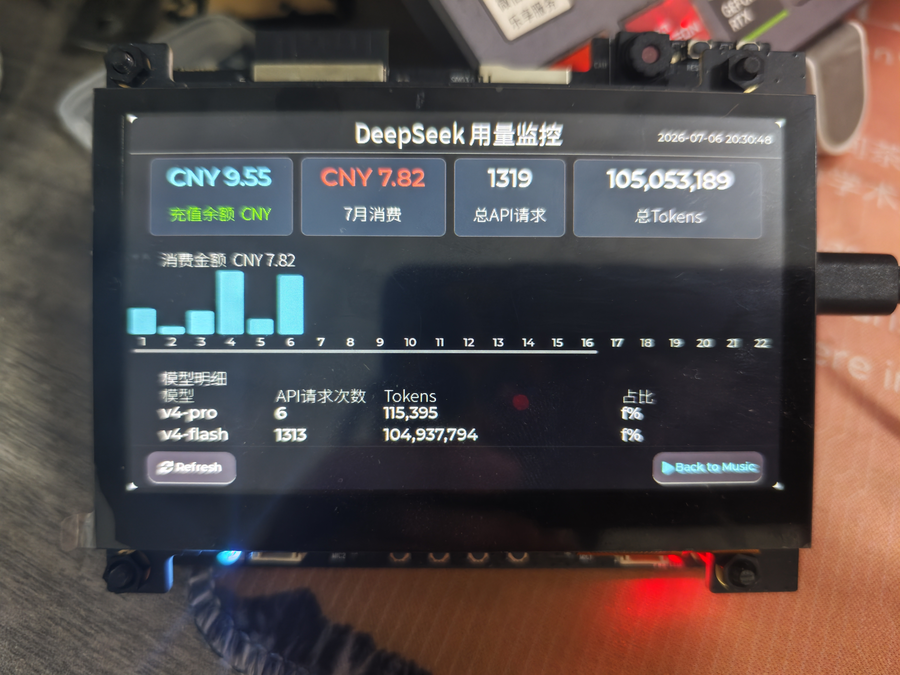

<h1 align="center">desk-beam</h1>
<p align="center">
  <em>ESP32-S31 桌面副屏伴侣 — 歌词显示 · 氛围灯 · DeepSeek 用量监控</em>
</p>


<p align="center">
  
  
  
  
</p>

---

## 📖 概览

**desk-beam** 是一个基于 ESP32-S31 的桌面副屏，通过 WiFi/WebSocket 连接 PC 端服务，实现：

- 🎵 **桌面歌词显示** — 同步 QQ 音乐/网易云等播放器的滚动歌词
- 💡 **WS2812 氛围灯** — 随音乐律动（脉冲/呼吸/彩虹）
- 🎮 **音乐遥控器** — 通过 ADC 按键远程控制播放
- 📊 **DeepSeek 用量监控** — 实时查看 API 余额和消耗

```
QQ音乐/网易云 → Windows SMTC → PC 桥接服务 → WebSocket → ESP32 → LVGL 屏幕 + WS2812
```

---

## ✨ 特性

- **全屏歌词界面** — LVGL 8.4 渲染，6 行滚动，4 种显示模式（歌词/正在播放/频谱/信息）
- **中文显示** — 预渲染 Noto Sans SC 中文字库（20px + 28px RLE 压缩）
- **WS2812 氛围灯** — 3 颗灯珠，4 种效果模式（脉冲/呼吸/彩虹/关闭），亮度可调
- **DeepSeek 用量可视化** — 余额卡片 + 消费柱状图 + 模型明细表
- **WiFi 自动连接** — STA 模式 + 事件组同步 + 超时保护
- **WebSocket 全双工** — 自动重连（指数退避）+ JSON 协议
- **SD 卡支持** — SDMMC 4-bit FATFS 挂载（可选）
- **触摸交互** — GT1151 触摸 + ADC 按键双输入
- **专辑封面缓存** (计划中) — SD 卡存储 PC 端推送的专辑封面图，减少网络依赖

---

## 🖥️ 演示

| 音乐歌词屏 | DeepSeek 用量屏 |
|:---:|:---:|
|  |  |

---

## 🛠️ 硬件

### 物料清单

| 组件 | 型号 | 数量 |
|------|------|:----:|
| SoC 开发板 | ESP32-S31-Korvo-2-LCD | ×1 |
| LCD 屏幕 | ST7262E43 800×480 RGB565 并行接口 | ×1 |
| 触摸芯片 | GT1151 (I2C) | ×1 |
| RGB LED | WS2812 | ×3 |
| SD 卡 | microSD (用于存储扩展) | ×1 |
| 电源 | 5V USB-C | ×1 |

### 引脚定义

| 功能 | GPIO | 总线 |
|------|:----:|------|
| LCD 数据 | GPIO8~36 (16bit) | RGB565 并行 |
| LCD 同步 | HSYNC=44, VSYNC=45, DE=43, PCLK=40 | — |
| 触摸 I2C | SDA=0, SCL=1 | I2C |
| WS2812 | GPIO37 | RMT TX |
| ADC 按键 | GPIO42 | 分压阵列 (×4 按键) |
| SD 卡 | CLK=24, CMD=25, D0~D3=20~23 | SDMMC 4-bit |

> 引脚定义详情见 [components/bsp/include/bsp/bsp_board.h](components/bsp/include/bsp/bsp_board.h)

---

## 🚀 快速开始

### 1️⃣ 环境准备

- **ESP-IDF** v6.2+（目标芯片 `esp32s31`）
- **PSRAM** 已启用（LVGL 显示缓冲必需）
- 安装依赖：

```bash
# ESP-IDF 组件管理器自动安装 LVGL + WebSocket 等
idf.py set-target esp32s31
idf.py build
```

### 2️⃣ 配置 WiFi 和 PC 地址

**修改 `main/main.c` 中的配置区：**

```c
// 第 50-57 行 — 替换为你自己的信息
#define WIFI_SSID       "你的WiFi名称"      // 仅支持 2.4GHz
#define WIFI_PASSWORD   "你的WiFi密码"
#define PC_HOST         "192.168.1.100"    // 运行 PC 端的电脑 IP
#define PC_WS_PORT      8765               // WebSocket 端口（默认不变）
```

> ⚠️ **重要**：提交代码前请确认 `WIFI_SSID` / `WIFI_PASSWORD` 已恢复为占位符 `"xxxxxxxx"`，防止泄露家庭 WiFi 密码。

### 3️⃣ 烧录

```bash
idf.py -p COMx flash monitor
```

### 4️⃣ 启动 PC 端服务

参见 [PC 端服务](#pc-端服务) 章节。

---

## 🏗️ 架构

### 软件层级

```
┌─────────────────────────────────────────────────────────────┐
│                    应用层 (main/)                            │
│  app_music_screen    app_deepseek_screen    app_led_effects │
│  app_ws_client       app_network            app_logic       │
├─────────────────────────────────────────────────────────────┤
│                    硬件抽象层 (components/)                   │
│  hal_display  hal_led  hal_key  hal_sdcard  bsp             │
├─────────────────────────────────────────────────────────────┤
│                  中间件 (managed_components/)                 │
│  LVGL 8.x  esp_lvgl_port  esp_websocket_client  cJSON       │
├─────────────────────────────────────────────────────────────┤
│                     FreeRTOS + ESP-IDF                       │
└─────────────────────────────────────────────────────────────┘
```

### 任务调度

| 任务 | 优先级 | 栈大小 | 核心 | 职责 |
|------|:------:|:------:|:----:|------|
| LVGL 主循环 | — | 继承 | — | `lv_timer_handler()` 驱动 |
| `hal_key` | 5 | 4KB | — | ADC 按键扫描 + 消抖 |
| `app_ws` | 4 | 8KB | 0 | WebSocket 收发 + 消息分发 |
| `network_task` | 3 | 8KB | — | WiFi 连接 + 状态监控 |
| `app_led_effects` | 3 | 2KB | — | WS2812 效果帧渲染 |

### 启动流程

```
app_main()
  ├─ BSP 初始化
  ├─ LCD 初始化 (RGB 并行)
  ├─ LVGL 端口注册 (显示+触摸)
  ├─ 音乐屏幕创建
  ├─ DeepSeek 屏幕创建
  ├─ LED 效果任务启动
  ├─ 按键扫描任务启动
  ├─ 网络任务启动 (WiFi → WebSocket)
  └─ LVGL 主循环
```

---

## 💻 PC 端服务

### 安装与启动

```bash
cd pc_tools
pip install -r requirements.txt
python windows_media_server.py
```

启动后监听 `ws://0.0.0.0:8765`，控制台会打印本机局域网 IP 地址，用于配置 ESP32 的 `PC_HOST`。

### 歌词查询优先级

| 来源 | 说明 |
|------|------|
| 🥇 QQ Music API | SMTC Track ID 直达，最精准 |
| 🥈 网易云音乐 API | 标题+歌手通用搜索 |
| 🥉 LRCLIB | 海外公共 API 兜底 |

### 快捷键

| 按键 | 功能 |
|:----:|------|
| `P` | 暂停/恢复 WebSocket 广播 |
| `Q` | 退出服务器 |

### DeepSeek 用量数据集成

PC 端支持读取本地 JSON 文件，将 DeepSeek API 用量数据推送到 ESP32 显示。

#### 命令行模式（直接指定文件路径）

```bash
python windows_media_server.py --deepseek-file D:\path\to\deepseek_usage_data.json
```

#### 集成 WorkBuddy 自动化抓取（推荐）

本项目配套了 WorkBuddy Skill，可每小时自动从 DeepSeek 开放平台用量页面抓取数据，生成 JSON 文件供 ESP32 读取。

**数据流：**

```
Edge 浏览器 (已登录 platform.deepseek.com)
    ↓ CDP 自动化抓取 (每小时一次)
deepseek_usage_data.json (本地文件)
    ↓ windows_media_server.py 每 300s 读取
WebSocket → deepseek_usage 消息
ESP32 屏幕 (DeepSeek 用量页面)
```

**前置条件：**

1. [安装 WorkBuddy](https://workbuddy.ai)（Claude Code 插件）
2. Edge 浏览器登录 [platform.deepseek.com](https://platform.deepseek.com)
3. 开启 Edge 远程调试：访问 `edge://inspect/#remote-debugging`，勾选 **"Allow remote debugging for this browser instance"**
4. 安装 Skill 文件（见下方）

#### WorkBuddy Skill 安装

```bash
# Skill 定义位于 pc_tools/deepseek_skill/ 目录
# 在 WorkBuddy 配置中导入或链接：
#   pc_tools/deepseek_skill/SKILL.md
```

安装后可通过以下方式触发：

- **自动**：WorkBuddy 定时任务每小时抓取一次
- **手动**：在 WorkBuddy 中说 `查一下 DeepSeek 用量` 或 `deepseek usage`

Skill 包含的脚本：

| 文件 | 用途 |
|------|------|
| `scripts/parse_usage.py` | 从 CDP 提取的页面文本中解析余额/消费/模型用量 |
| `scripts/generate_report.py` | 生成带 Chart.js 的可视化 HTML 报告 |

> 详细文档见 [docs/deepseek_data_pipeline.md](docs/deepseek_data_pipeline.md)

**不需要 DeepSeek 功能？** 启动时不传 `--deepseek-file` 参数即可，ESP32 会显示"No Data"占位。

---

## 🔌 WebSocket 协议

### PC → ESP32（下行）

```json
{
  "type": "song_info",
  "title": "歌名",
  "artist": "歌手",
  "duration_ms": 240000,
  "position_ms": 45000,
  "state": "playing"
}
```

| type | 说明 |
|------|------|
| `song_info` | 歌曲完整状态（标题/歌手/进度/播放状态） |
| `lyrics` | 带时间戳的歌词行数组 |
| `position` | 播放进度（每秒 1 次推送） |
| `server_status` | 服务器暂停/恢复通知 |
| `deepseek_usage` | DeepSeek 用量数据 |

### ESP32 → PC（上行）

```json
{ "type": "command", "action": "play_pause" }
```

| action | 说明 |
|--------|------|
| `play_pause` | 播放/暂停切换 |
| `next` / `prev` | 切歌 |
| `seek` | 跳转进度（附带 `position_ms`） |
| `toggle_shuffle` / `toggle_repeat` | 随机/循环切换 |
| `deepseek_refresh` | 手动刷新 DeepSeek 用量 |

---

## 💡 氛围灯效果

| 模式 | 触发 | 行为 |
|------|------|------|
| **脉冲** | 默认 / 歌词换行 | ATTACK 200ms → DECAY 400ms → 微光 8%。暂停时自动切换彩虹 |
| **呼吸** | 手动切换 | 暖色正弦波呼吸，2s 周期 |
| **彩虹** | 手动切换 | HSV 色相循环，8s 周期，40% 亮度 |
| **关闭** | 手动切换 | 全灭 |

> 颜色序为 **GRB**（WS2812 标准），`hal_led` 内部已按 G→R→B 写入，调用层无需关心。

---

## 🎮 按键映射

| 按键 | 短按 | 长按 (≥1s) |
|------|------|------------|
| **SET** | ⏭ 下一首 | 切换 LED 效果模式 |
| **MODE** | 切换歌词显示模式 | 切换 LED 开关 |
| **VOL-** | 音量减 | LED 亮度减 (步进 20) |
| **VOL+** | 音量加 | LED 亮度加 (步进 20) |

> ADC 按键通过电阻分压识别（非矩阵扫描），4 个按键共用 GPIO42。

---

## 📁 项目结构

```
desk-beam/
├── main/                          # 应用层固件
│   ├── main.c                     # 入口 + 启动编排 ← 配置 WiFi/PC_HOST 在这里
│   ├── app_music_screen.c/.h      # 全屏音乐歌词界面
│   ├── app_deepseek_screen.c/.h   # DeepSeek 用量可视化页面
│   ├── app_ws_client.c/.h         # WebSocket 客户端 + JSON 协议
│   ├── app_network.c/.h           # WiFi STA 连接管理
│   ├── app_led_effects.c/.h       # WS2812 氛围灯效果引擎
│   ├── app_logic.c/.h             # 按键 → 控制调度
│   ├── app_ui.c/.h                # LVGL 端口初始化
│   ├── font_noto_sc_20.c          # Noto Sans SC 20px 字库 (RLE)
│   └── font_noto_sc_28.c          # Noto Sans SC 28px 字库 (RLE)
├── components/                    # 硬件抽象层
│   ├── bsp/                       # 板级硬件配置 + 编译验证
│   ├── hal_display/               # LCD + GT1151 触摸驱动
│   ├── hal_led/                   # WS2812 RMT 驱动
│   ├── hal_key/                   # ADC 按键阵列扫描
│   └── hal_sdcard/                # SD 卡 SDMMC + FATFS
├── pc_tools/                      # PC 端配套工具
│   ├── windows_media_server.py    # SMTC 桥接服务 (核心)
│   ├── requirements.txt           # Python 依赖
│   └── deepseek_skill/            # WorkBuddy 自动化抓取 Skill
│       ├── SKILL.md               # Skill 定义与说明
│       └── scripts/               # 解析与报告生成脚本
├── docs/                          # 文档
│   ├── deepseek_data_pipeline.md  # DeepSeek 数据管道详解
│   └── ...其他设计文档
├── partitions.csv                 # 16MB 分区表
├── sdkconfig                      # ESP-IDF 项目配置
├── .gitignore                     # 已排除敏感文件和构建产物
├── .vscode/settings.json.example  # VS Code 配置模板（不含绝对路径）
└── README.md                      # ← 你现在在看这个
```

---

## 🔧 常见问题

### Q: ESP32 无法连接 WiFi？
- 确认 WiFi 是 **2.4 GHz**（ESP32-S31 不支持 5 GHz）
- 检查 `main.c` 中的 `WIFI_SSID` / `WIFI_PASSWORD` 是否正确
- 查看串口日志：`idf.py -p COMx monitor`

### Q: 屏幕显示但歌词不刷新？
- 确认 PC 端 `windows_media_server.py` 正在运行
- 检查 `PC_HOST` IP 地址是否正确
- 确认 Windows 播放器（QQ音乐/网易云）正在播放

### Q: DeepSeek 页面显示 "No Data"？
- PC 端启动时是否加了 `--deepseek-file` 参数
- 检查 JSON 文件路径是否正确
- WorkBuddy 自动化可能还未执行首次抓取

### Q: 如何自定义 LVGL 界面？
- 所有 UI 代码在 `main/app_music_screen.c` 和 `main/app_deepseek_screen.c`
- LVGL 8.x API：`lv_obj_t` → `lv_label_create()`、`lv_btn_create()` 等

### Q: 烧录后屏幕白屏/黑屏？
- 确认 PSRAM 已在 menuconfig 中启用
- 检查 LCD 排线连接
- 查看串口日志的 `ESP_ERROR_CHECK` 输出

---

## 🤝 贡献

欢迎 Issue 和 Pull Request！请确保：

1. 代码风格与现有代码一致（命名、注释语言、文件组织）
2. 提交前通过 `idf.py build` 编译通过
3. `.gitignore` 中没有遗漏敏感文件

---

## 给个Star⭐️        

## 📄 License

MIT © 2026 Yunxiao11Xie

---

<p align="center">
  <sub>Built with ❤️ using ESP-IDF, LVGL, and a lot of ☕</sub>
</p>
